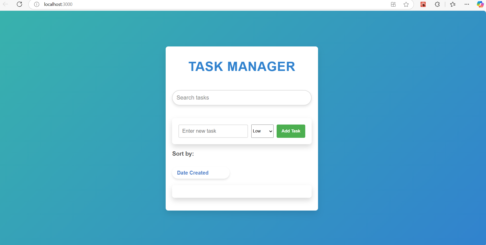
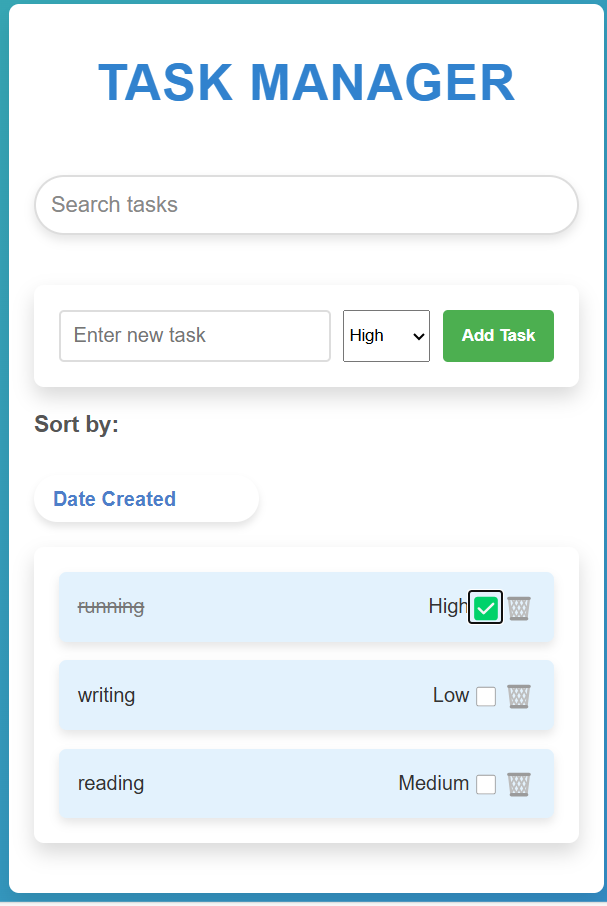
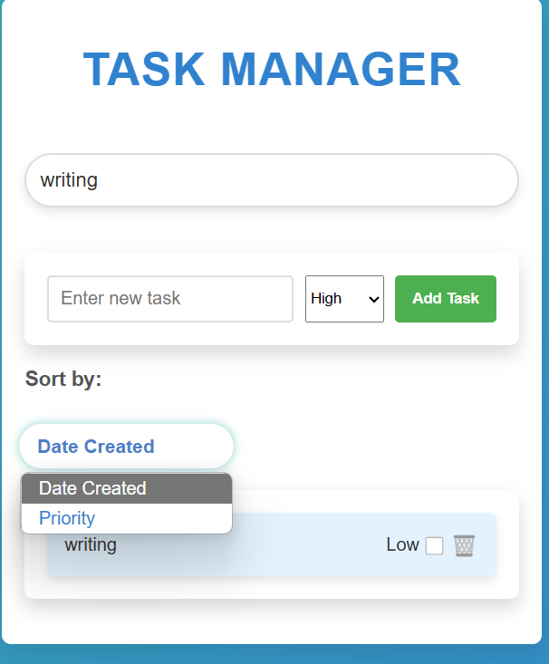
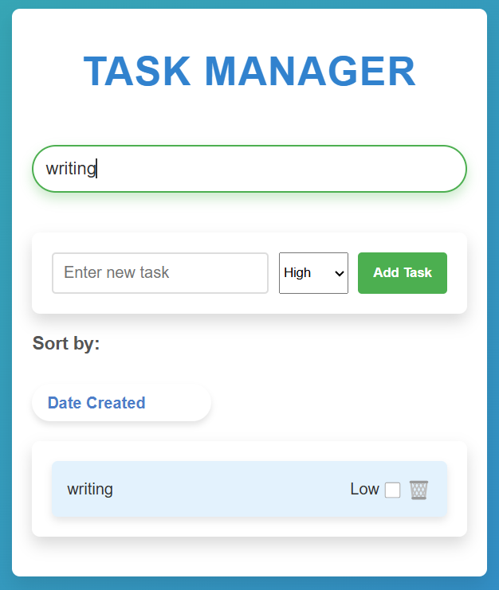

# Task Manager App

## Live Demo

You can try the live version of the **Task Manager App** here: [Deployed Link](https://taskmanagerreactvijayg.netlify.app)

## Overview

The Task Manager App is a simple, yet functional, task management tool built with React.js. It allows users to manage their daily tasks by adding new tasks, marking tasks as completed, deleting tasks, and storing tasks in the browser's local storage for persistence. Users can also search for tasks and prioritize them.

### `Key Features:`

`Task Addition`: Users can add new tasks through an input field.
`Task Completion`: Mark tasks as completed with a button that crosses out the task.
`Task Deletion`: Users can delete tasks from the list.
`Search`: Search for tasks based on the title.
`Priority Setting`: Set task priorities with a dropdown menu.
`Persistence`: Tasks are stored in local storage, ensuring that tasks persist across page reloads.
`Responsive Design`: The application adjusts its layout across different screen sizes.

### `Setup and Launch`

Follow these steps to get your project up and running:

1. `Clone the Repository:`
   git clone https://github.com/Vijayganaboina/react-task-manager.git
   cd react-task-manager

2. `Install Dependencies:`
   Make sure you have Node.js and npm installed.
   Install the necessary dependencies:

   npm install

3. `Run the Application:`
   To start the app in development mode, run:

   npm start

   This will start the app on http://localhost:3000 in your browser.

4. `Build for Production:`
   To create a production build of the app, run:

   npm run build

   The production build will be available in the build/ directory.

### `Assumptions Made During Development`

1. Local Storage: The app uses the browser's local storage for task persistence. This means that the tasks will persist even after the page is reloaded but will not persist across different devices or browsers.

2. Simple UI: The user interface is designed to be minimalist and straightforward, without any complex styling or animations.

3. No User Authentication: The app doesn't include any form of user authentication, meaning tasks are not tied to specific users.

### `Screenshots`

1. `Main Page`

   

2. `Task List`

   

3. `Sorting tasks`

   

4. `searching task`

   
